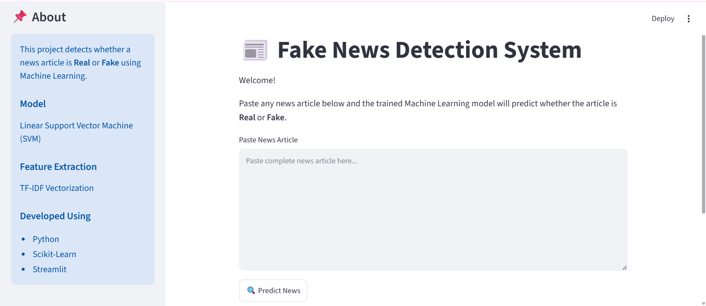
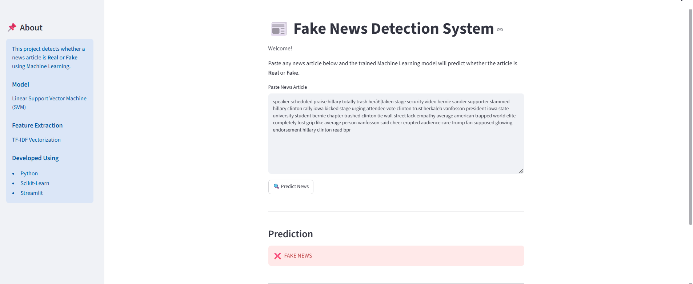
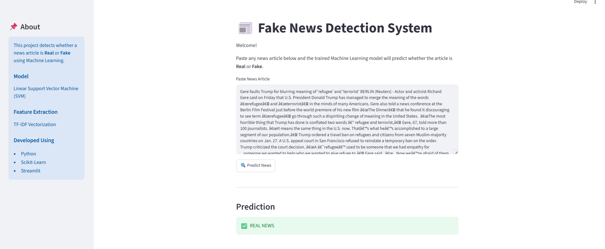
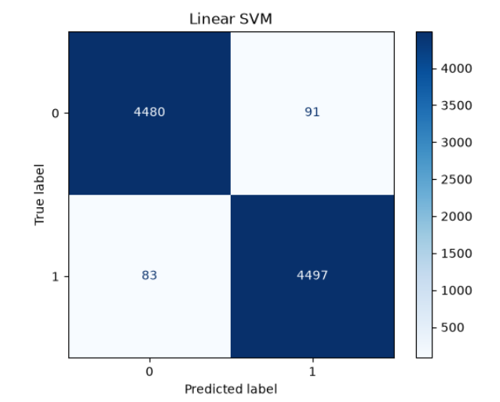
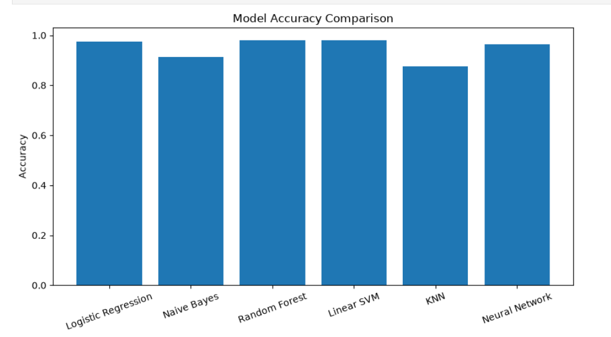

## 🚀 Live Demo

🔗 https://fake-news-detection-using-machine-learning-wleefmmw33chul9nvqt.streamlit.app

# 📰 Fake News Detection System

A Machine Learning-based web application that detects whether a news article is **Real** or **Fake** using Natural Language Processing (NLP) and a Linear Support Vector Machine (SVM). The application is deployed using **Streamlit** and provides a simple interface for users to classify news articles.

---

## 📌 Project Overview

Fake news spreads rapidly through digital platforms and social media, making it difficult for users to verify the authenticity of information.

This project uses **Natural Language Processing (NLP)** techniques to preprocess news articles, convert them into numerical features using **TF-IDF Vectorization**, and classify them using Machine Learning algorithms.

---

## 🎯 Objectives

- Detect fake news using Machine Learning.
- Build an end-to-end NLP pipeline.
- Compare multiple classification algorithms.
- Deploy the best-performing model using Streamlit.
- Create a user-friendly web application.

---

## 📂 Dataset

Dataset: Fake and Real News Dataset

Features:

- News Text
- Label (Real / Fake)

The dataset contains approximately **45,000 news articles**.

---

## ⚙️ Technologies Used

- Python
- Pandas
- NumPy
- Scikit-learn
- Matplotlib
- Plotly
- Streamlit
- Joblib

---

## 🧠 Machine Learning Workflow

1. Data Collection
2. Data Understanding
3. Text Preprocessing
4. Exploratory Data Analysis (EDA)
5. Feature Engineering
6. TF-IDF Vectorization
7. Model Training
8. Model Evaluation
9. Model Comparison
10. Streamlit Deployment

---

## 🤖 Models Implemented

- Logistic Regression
- Naive Bayes
- Random Forest
- Linear Support Vector Machine (Best Model)

---

## 📊 Model Performance

| Model | Accuracy |
|--------|----------|
| Logistic Regression | 97.5% |
| Random Forest | 97.97% |
| Naive Bayes | 92.43% |
| Linear SVM | **98.31%** ✅ |

---

## 📁 Project Structure

```
Fake-News-Detection-System/

│── app.py
│── README.md
│── requirements.txt

├── data/
├── models/
├── notebooks/
├── outputs/
├── presentation/
├── report/
```

---

## 🚀 Installation

Clone the repository

```bash
git clone <repository-link>
```

Install dependencies

```bash
pip install -r requirements.txt
```

Run the application

```bash
streamlit run app.py
```

---

## 💻 Application Features

- Paste any news article.
- Predict whether it is Real or Fake.
- Simple and interactive Streamlit interface.
- Fast prediction using a trained Machine Learning model.

---


## 📸 Screenshots

### 🏠 Home Page



---

### ❌ Fake News Prediction



---

### ✅ Real News Prediction



### Model Accuracy Comparison



### Linear SVM Confusion Matrix




---

## 🔮 Future Improvements

- Deep Learning Models (LSTM/BERT)
- Confidence Score
- Explainable AI (SHAP/LIME)
- Real-time News API Integration
- Multilingual Fake News Detection

---

## 👩‍💻 Author

**Prachi**

Machine Learning | Data Science | Artificial Intelligence

---

## ⭐ Acknowledgements

This project was developed as part of an end-to-end Machine Learning and Natural Language Processing portfolio.